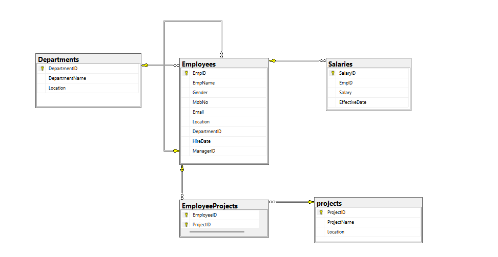

# TechNova HR & Employee Analytics

## Project Overview

TechNova HR & Employee Analytics is a SQL Server database project designed to manage and analyze employee, department, salary, project, and reporting-structure data.

The project was built to demonstrate practical SQL skills through relational database design, data integrity constraints, analytical queries, subqueries, Common Table Expressions (CTEs), window functions, date analysis, and business-oriented reporting.

The database models a realistic HR environment where:

- Employees belong to departments.
- Employees can work on multiple projects.
- Projects can have multiple employees.
- Employees can report to other employees.
- Employees can have salary records with effective dates.
- HR and management can analyze employee, salary, project, and tenure information.

---

## Objectives

The main objectives of the project are:

- Design a relational database for an HR environment.
- Implement primary keys, foreign keys, unique constraints and check constraints.
- Model one-to-many and many-to-many relationships.
- Implement a self-referencing employee-manager relationship.
- Write SQL queries ranging from basic retrieval to advanced analytical reporting.
- Practice JOINs, aggregations, subqueries, CTEs, EXISTS, NOT EXISTS and window functions.
- Solve realistic business questions using SQL.

---

## Technology

- Microsoft SQL Server 2022 Developer Edition
- SQL Server Management Studio (SSMS)
- T-SQL
- Git / GitHub

---

## Database Schema

The database contains five main tables:

### Departments

Stores information about organizational departments.

### Employees

Stores employee master information including department, location, joining date and manager relationship.

### Salaries

Stores employee salary records and effective dates.

### Projects

Stores organizational project information.

### EmployeeProjects

Bridge table used to implement the many-to-many relationship between employees and projects.

---

## Entity Relationship Diagram



---

## Relationships

The database contains the following relationships:

- Departments -> Employees
- Employees -> Salaries
- Employees -> EmployeeProjects
- Projects -> EmployeeProjects
- Employees -> Employees through ManagerID

The EmployeeProjects table resolves the many-to-many relationship between Employees and Projects.

The Employees table also contains a self-referencing relationship where ManagerID references another employee's EmpID.

---

## SQL Concepts Demonstrated

### Database Design

- Primary Keys
- Foreign Keys
- Composite Primary Keys
- UNIQUE constraints
- CHECK constraints
- NOT NULL constraints
- IDENTITY
- Self-referencing foreign keys
- Many-to-many relationships

### Querying

- SELECT
- WHERE
- ORDER BY
- DISTINCT
- LIKE
- INNER JOIN
- LEFT JOIN
- SELF JOIN
- GROUP BY
- HAVING

### Aggregation

- COUNT
- SUM
- AVG
- MIN
- MAX

### Advanced SQL

- CASE expressions
- COALESCE
- Scalar subqueries
- Correlated subqueries
- IN
- EXISTS
- NOT EXISTS
- Common Table Expressions (CTEs)
- RANK
- ROW_NUMBER
- DENSE_RANK
- Window functions
- Date calculations

### Data Validation and Integrity

- Referential integrity verification
- Orphan record checks
- Duplicate relationship checks
- Employee-project relationship validation
- Employee-manager relationship validation
- Salary record validation

---

## Business Analysis

The project contains SQL solutions for business questions such as:

- How many employees work in each department?
- Which departments have the highest salary expenditure?
- Which employees earn more than their department average?
- Which employees are not assigned to any project?
- Which projects have no employees assigned?
- Who are the highest-paid employees in each department?
- What is the average employee tenure by department?
- Which employees have more project assignments than the average?
- What is the salary difference between an employee and their department average?
- What are the highest salary ranks within each department?

Advanced business questions are available in:

sql/05_Business_Questions.sql

---

## Project Structure

```text
01_TechNovaHR/
|
+-- README.md
|
+-- sql/
|   +-- 01_Create_Database.sql
|   +-- 02_Create_Tables.sql
|   +-- 03_Insert_Data.sql
|   +-- 04_Analysis_Queries.sql
|   +-- 05_Business_Questions.sql
|   +-- 06_Verification_Queries.sql
|
+-- Docs/
    +-- ERD.png
```

---

## How to Run the Project

### Step 1 - Create the database

Open sql/01_Create_Database.sql in SQL Server Management Studio and execute it.

### Step 2 - Create the tables

Execute:

sql/02_Create_Tables.sql

This creates the database tables, constraints and relationships.

### Step 3 - Insert the sample data

Execute:

sql/03_Insert_Data.sql

This populates the database with sample departments, employees, salaries, projects and employee-project assignments.

### Step 4 - Run the analysis queries

Execute:

sql/04_Analysis_Queries.sql

This file contains the complete set of SQL queries developed throughout the project, progressing from basic queries to advanced analytical queries.

### Step 5 - Run the business questions

Execute:

sql/05_Business_Questions.sql

This file contains advanced business-oriented SQL problems combining multiple SQL concepts.

---

## Sample Data

The project contains sample data for:

* 5 departments
* 10 employees
* 5 projects
* 10 salary records
* Multiple employee-project assignments
* Employee-manager relationships

The dataset is intentionally small so that the SQL logic can be easily understood and verified.

### Step 6 - Verify the database

Execute:

`sql/06_Verification_Queries.sql`

This file contains validation queries used to verify:

- Expected row counts
- Foreign key relationships
- Employee-project relationships
- Employee-manager relationships
- Orphan records
- Duplicate assignments
- Salary record relationships

This file is optional and is intended for development and validation rather than database setup.

---

## Key Design Decisions

### Many-to-Many Employee and Project Relationship

An employee can work on multiple projects, and a project can have multiple employees.

Therefore, a bridge table named EmployeeProjects is used instead of storing a single project reference in Employees or a single employee reference in Projects.

### Composite Primary Key

EmployeeProjects uses:

(EmployeeID, ProjectID)

as its composite primary key.

This prevents the same employee from being assigned to the same project more than once.

### Salary Data Type

Salary is stored using DECIMAL(10,2) because salary represents a monetary value where predictable decimal precision is required.

### Self-Referencing Employee Relationship

Employees.ManagerID references Employees.EmpID.

This allows the database to represent reporting structures such as:
```
Amit
|
+-- Priya
|   |
|   +-- Neha
|
+-- Rahul
```
---

## Learning Progression

The project was built progressively:

Basic SQL
    ->
JOINs and Aggregations
    ->
CASE Expressions
    ->
Subqueries
    ->
EXISTS / NOT EXISTS / IN
    ->
CTEs
    ->
Window Functions
    ->
Date Analysis
    ->
Self Joins and NULL Handling
    ->
Advanced Business Questions

The goal was not only to create a working database, but to understand why different SQL techniques are appropriate for different business requirements.

---

## Future Improvements

Possible future enhancements include:

* Stored procedures for common business operations
* Additional salary history
* Indexing and query-performance analysis
* Execution-plan comparisons
* Audit logging
* Larger datasets for performance testing
* Additional reporting and analytics

---

## Author

Chandan Raj Tripathi
